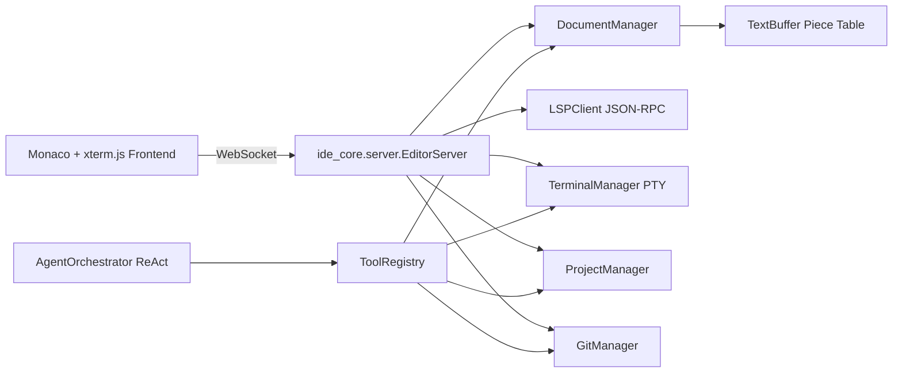

# IDE Core Engine

<p align="center">
  <a href="https://github.com/your-org/ide-core/actions/workflows/ci.yml">
    
  </a>
  
  <a href="LICENSE">
    
  </a>
  <a href="https://github.com/your-org/ide-core/releases">
    
  </a>
</p>

The **IDE Core Engine** is a modular, open-source IDE backend written in Python. It combines a piece-table text buffer, asynchronous LSP client, persistent terminal PTY, Git integration, project workspace scanning, and an autonomous ReAct agent into a single WebSocket gateway that powers a Monaco + xterm.js frontend.

## Features

- **Piece Table Text Buffer** — immutable `original` and append-only `add` buffers make edits non-destructive and support undo/snapshot workflows.
- **LSP Client** — async JSON-RPC client for language servers (Python, TypeScript, etc.) with `textDocument/didOpen`, `didChange`, `completion`, and diagnostic publishing.
- **Autonomous ReAct Agent** — `AgentOrchestrator` drives an iterative tool loop with file, search, command, and diagnostic tools.
- **Monaco Editor UI** — `frontend/index.html` loads Monaco Editor via CDN and connects over WebSocket.
- **xterm.js PTY** — `TerminalManager` spawns a persistent shell and streams output to the UI.
- **Git Diffing** — `GitManager` provides status, staging, commit, and per-file diff support.
- **Pydantic Settings** — configuration loaded from `.env` or environment variables.
- **62+ passing pytest suite** covering buffer, document, LSP, agent, server, and integration tests.

## Architecture



## Quickstart

1. Clone the repository and create a virtual environment:

```bash
git clone https://github.com/your-org/ide-core.git
cd ide-core
python -m venv .venv
.venv\Scripts\activate  # Windows
# or: source .venv/bin/activate  # Linux/macOS
```

2. Install dependencies:

```bash
pip install -r requirements.txt
```

3. (Optional) Install a Python language server:

```bash
pip install python-lsp-server
```

4. Create a `.env` file with at least a JWT secret:

```bash
JWT_SECRET=change-me-in-production
```

5. Start the WebSocket server:

```bash
python -m ide_core.server
```

6. Open `frontend/index.html` in a browser (or serve it with any static file server).

## Configuration

`ide_core.config.settings.IDESettings` loads values from a `.env` file or environment variables. Common settings:

| Variable | Default | Description |
|---|---|---|
| `OPENAI_API_KEY` | `""` | OpenAI API key for the agent. |
| `ANTHROPIC_API_KEY` | `""` | Anthropic API key for the agent. |
| `DEFAULT_MODEL` | `gpt-4o` | Default LLM model. |
| `DEFAULT_TEMPERATURE` | `0.2` | Sampling temperature. |
| `EDITOR_THEME` | `vs-dark` | Monaco editor theme. |
| `LSP_PYTHON_COMMAND` | `pylsp` | Command to start the Python language server. |
| `LSP_TYPESCRIPT_COMMAND` | `typescript-language-server --stdio` | TypeScript language server command. |
| `DIRECTORY_EXCLUSIONS` | `__pycache__,node_modules,.git,.venv,venv` | Directory exclude list (parsed as JSON list in `.env`). |
| `JWT_SECRET` | `dev-secret-change-in-production` | Secret for JWT token signing. |
| `JWT_ALGORITHM` | `HS256` | JWT algorithm. |
| `JWT_EXPIRY_MINUTES` | `60` | JWT expiry. |
| `LOG_LEVEL` | `INFO` | Log level. |
| `LOG_PATH` | `ide_engine.log` | Log file path. |
| `IDE_HOST` | `localhost` | WebSocket host. |
| `IDE_PORT` | `8765` | WebSocket port. |

## Development

Run the full test suite:

```bash
pytest
```

Build and run with Docker:

```bash
docker compose up --build
```

## Project Layout

```
ide_core/
  agent/          # ReAct agent and tools
  buffer.py       # Piece-table text buffer
  config/         # Pydantic settings
  diagnostics.py  # Diagnostic manager
  document_manager.py
  git/            # Git integration
  lsp/            # LSP client and protocol
  project/        # Workspace scanning
  server.py       # WebSocket gateway
  terminal.py     # PTY manager
frontend/
  index.html      # Monaco + xterm.js UI
  editor.js       # WebSocket client
tests/            # pytest suite
scripts/
  release.py      # Automated release script
```

## Contributing

See [CONTRIBUTING.md](CONTRIBUTING.md).

## License

This project is licensed under the MIT License — see [LICENSE](LICENSE).
