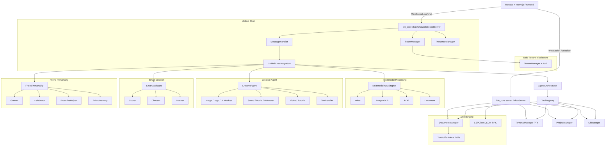

# IDE Core Engine

<p align="center">
  <a href="https://github.com/your-org/ide-core/actions/workflows/ci.yml">
    
  </a>
  
  <a href="LICENSE">
    
  </a>
  <a href="https://github.com/your-org/ide-core/releases">
    
  </a>
</p>

The **IDE Core Engine v2.0.0** is a modular, open-source AI IDE backend written in Python. It unifies a piece-table text buffer, LSP client, multi-tenant middleware, multimodal input processing, creative media generation, smart decision ranking, a friend personality layer, and an autonomous ReAct agent into a single WebSocket gateway. A professional workbench UI (Monaco + xterm.js + chat) is served by the server itself, and the backend ships with security gating, session/autosave reliability, extension loading, and production-readiness checks.

## Features

- **Piece Table Text Buffer** — immutable `original` and append-only `add` buffers make edits non-destructive and support undo/snapshot workflows.
- **LSP Client** — async JSON-RPC client for language servers (Python, TypeScript, etc.) with `textDocument/didOpen`, `didChange`, `completion`, and diagnostic publishing.
- **Autonomous ReAct Agent** — `AgentOrchestrator` drives an iterative tool loop with file, search, command, and diagnostic tools.
- **Multi-Tenant Middleware** — `TenantManager` isolates workspaces, auth, and chat data per tenant.
- **Multimodal Input Engine** — voice, image OCR, PDF, and document text extraction.
- **Creative Agent** — generates images, logos, sound, music, voiceovers, and video previews.
- **Smart Decision System** — `SmartAssistant` scores and ranks creative or code candidates with explanations.
- **Friend Personality** — `FriendPersonality` provides greetings, celebrations, encouragement, and memory.
- **Unified Chat Gateway** — `ChatWebSocketServer` routes text, voice, image, PDF, and creative requests through all subsystems.
- **Monaco Editor UI + Chat** — `frontend/index.html` loads Monaco Editor and the new chat panel over WebSocket.
- **xterm.js PTY** — `TerminalManager` spawns a persistent shell and streams output to the UI.
- **Git Diffing** — `GitManager` provides status, staging, commit, and per-file diff support.
- **Pydantic Settings** — configuration loaded from `.env` or environment variables.
- **218 passing pytest suite** covering buffer, document, LSP, agent, server, tenant, multimodal, creative, smart decision, personality, chat, security, extensions, reliability, and deployment tests.
- **Security / Sandboxing** — command allowlists, blocklists, confirmation patterns, and terminal cwd jailing.
- **Session + Autosave** — crash recovery via session snapshots and periodic dirty-buffer autosave.
- **Extension Loader** — discover and load plugins from `extensions_dir` with a hook registry.
- **Production Readiness** — startup checks for JWT secret length, insecure algorithms, and unsafe defaults.

## Architecture



## Quickstart

1. Clone the repository and create a virtual environment:

```bash
git clone https://github.com/your-org/ide-core.git
cd ide-core
python -m venv .venv
.venv\Scripts\activate  # Windows
# or: source .venv/bin/activate  # Linux/macOS
```

2. Install dependencies:

```bash
pip install -r requirements.txt
```

3. (Optional) Install a Python language server:

```bash
pip install python-lsp-server
```

4. Create a `.env` file with at least a 32-byte JWT secret:

```bash
cp .env.example .env
# edit .env and set a strong JWT_SECRET
```

5. Start the IDE server (it serves the workbench UI and WebSocket on the same port):

```bash
python -m ide_core.server
```

6. Open `http://localhost:8765` in your browser.

## Configuration

`ide_core.config.settings.IDESettings` loads values from a `.env` file or environment variables. Common settings:

| Variable | Default | Description |
|---|---|---|
| `OPENAI_API_KEY` | `""` | OpenAI API key for the agent. |
| `ANTHROPIC_API_KEY` | `""` | Anthropic API key for the agent. |
| `DEFAULT_MODEL` | `gpt-4o` | Default LLM model. |
| `DEFAULT_TEMPERATURE` | `0.2` | Sampling temperature. |
| `EDITOR_THEME` | `vs-dark` | Monaco editor theme. |
| `LSP_PYTHON_COMMAND` | `pylsp` | Command to start the Python language server. |
| `LSP_TYPESCRIPT_COMMAND` | `typescript-language-server --stdio` | TypeScript language server command. |
| `DIRECTORY_EXCLUSIONS` | `__pycache__,node_modules,.git,.venv,venv` | Directory exclude list (parsed as JSON list in `.env`). |
| `JWT_SECRET` | `dev-secret-change-in-production-32bytes` | Secret for JWT token signing (>= 32 bytes). |
| `JWT_ALGORITHM` | `HS256` | JWT algorithm. |
| `JWT_EXPIRY_MINUTES` | `60` | JWT expiry. |
| `LOG_LEVEL` | `INFO` | Log level. |
| `LOG_PATH` | `ide_engine.log` | Log file path. |
| `IDE_HOST` | `localhost` | Editor WebSocket host. |
| `IDE_PORT` | `8765` | Editor WebSocket port. |
| `ENABLE_MULTI_TENANT` | `False` | Enable multi-tenant workspaces. |
| `ENABLE_MULTIMODAL` | `True` | Enable voice, image, PDF, and document processing. |
| `ENABLE_VOICE_INPUT` | `True` | Enable voice transcription. |
| `ENABLE_IMAGE_OCR` | `True` | Enable image text extraction. |
| `ENABLE_PDF_PARSING` | `True` | Enable PDF text extraction. |
| `ENABLE_CREATIVE_AGENT` | `True` | Enable image, sound, and video generation. |
| `CREATIVE_TOOLS_PATH` | `.creative_tools` | Directory for generated creative assets. |
| `ENABLE_SMART_DECISIONS` | `True` | Enable candidate scoring and ranking. |
| `ENABLE_FRIEND_PERSONALITY` | `True` | Enable friendly greeting, celebration, and help. |
| `ENABLE_CHAT` | `True` | Enable the unified chat WebSocket gateway. |
| `CHAT_WEBSOCKET_PATH` | `/ws/chat` | Chat WebSocket path. |
| `CHAT_MESSAGE_HISTORY_LIMIT` | `100` | Max messages persisted per room. |
| `CHAT_PRESENCE_TIMEOUT` | `60` | Presence timeout in seconds. |
| `CHAT_ENABLE_FRIENDS` | `True` | Decorate chat responses with FriendPersonality. |
| `ENABLE_SECURITY_MANAGER` | `True` | Gate agent and terminal commands. |
| `ENABLE_EXTENSIONS` | `True` | Load plugins from `extensions_dir`. |
| `EXTENSIONS_DIR` | `extensions` | Directory containing plugin folders. |

## Development

Run the full test suite:

```bash
pytest
```

Build and run with Docker:

```bash
docker compose up --build
```

## Project Layout

```
ide_core/
  agent/           # ReAct agent and tools
  auth/            # JWT and tenant-aware auth
  buffer.py        # Piece-table text buffer
  chat/            # Unified chat subsystem
  config/          # Pydantic settings
  creative/        # Image, sound, video generation
  diagnostics.py   # Diagnostic manager
  document_manager.py
  git/             # Git integration
  lsp/             # LSP client and protocol
  multimodal/      # Voice, OCR, PDF, document input
  personality/     # Friend personality (greet, celebrate, memory)
  project/         # Workspace scanning
  server.py        # Editor WebSocket gateway
  smart_decision/  # Scorer, chooser, learner
  terminal.py      # PTY manager
  tenant/          # Multi-tenant middleware
frontend/
  index.html       # Monaco + xterm.js + Chat UI
  editor.js        # Editor WebSocket client
  chat_ui.js       # Chat client
  chat_ui.css      # Chat styles
tests/             # pytest suite (181 tests)
scripts/
  release.py       # Automated release script
```

## Contributing

See [CONTRIBUTING.md](CONTRIBUTING.md).

## License

This project is licensed under the MIT License — see [LICENSE](LICENSE).
